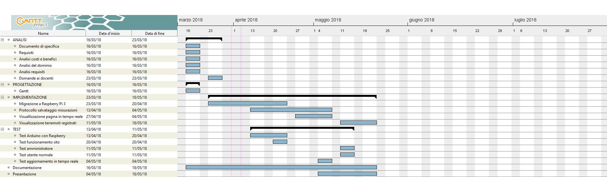
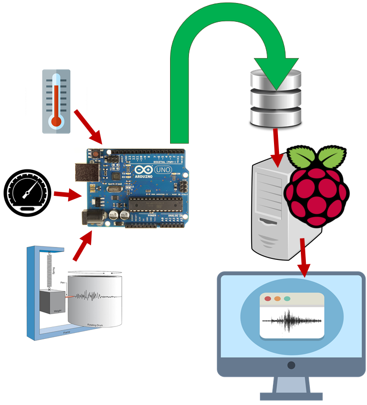
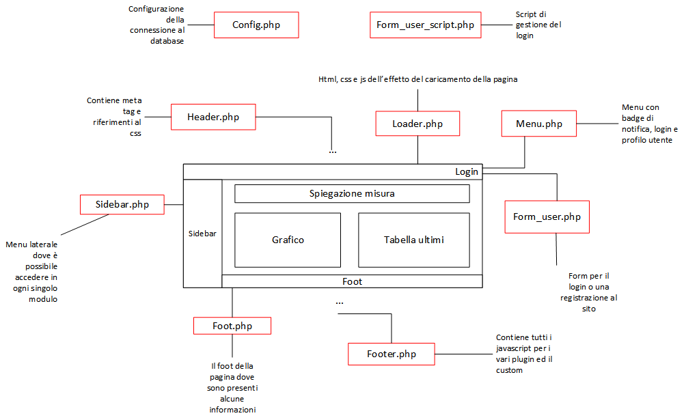
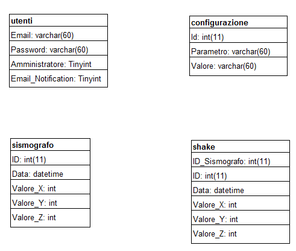
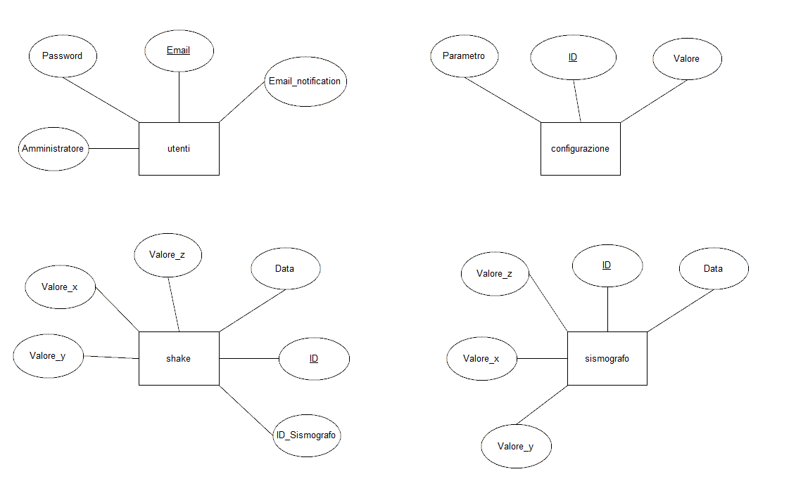
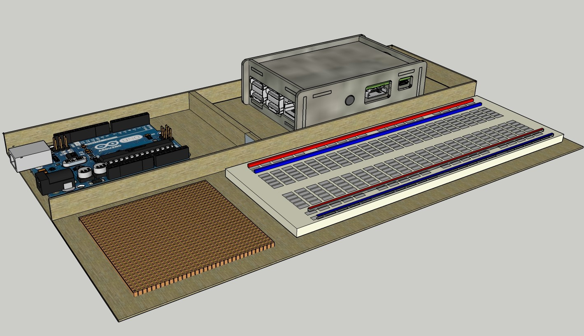
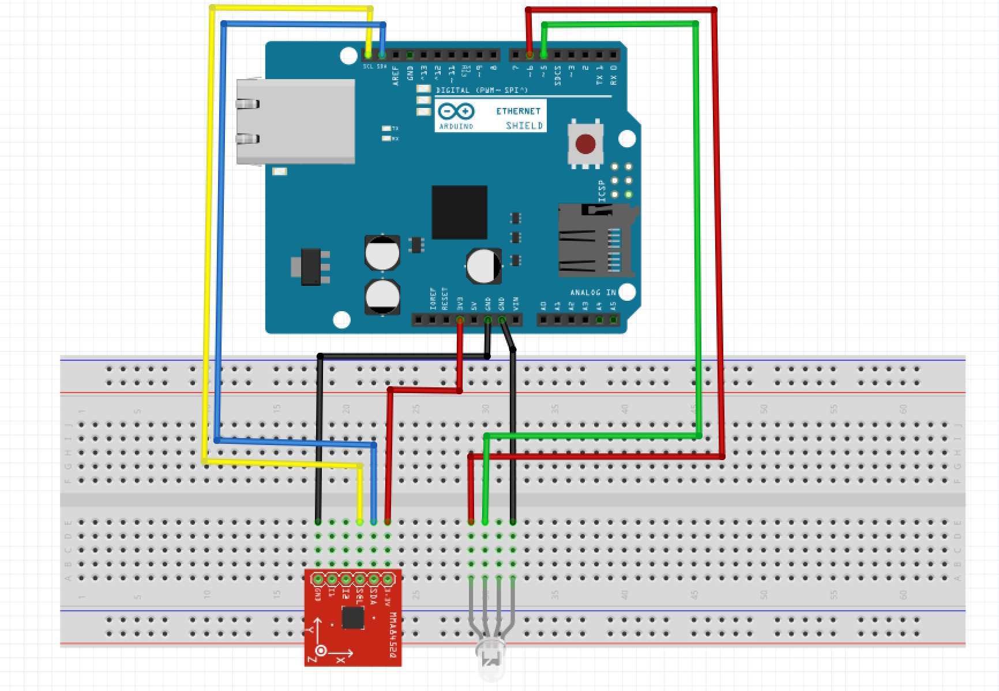
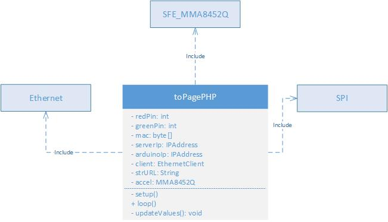
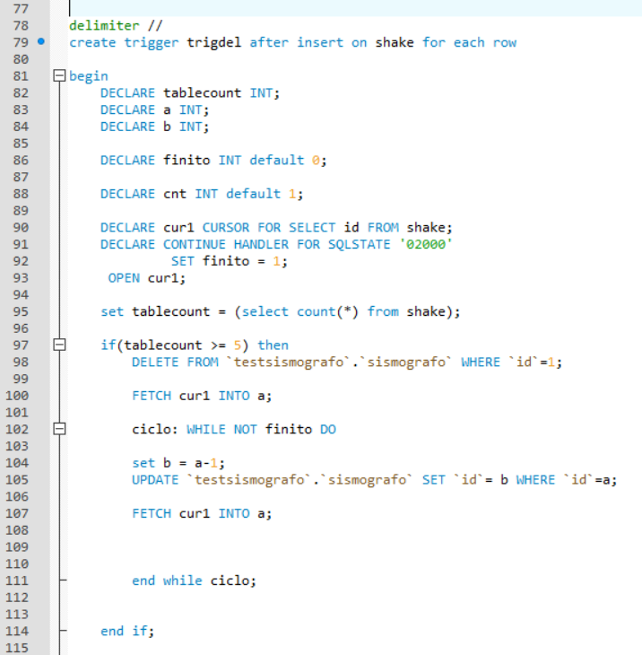
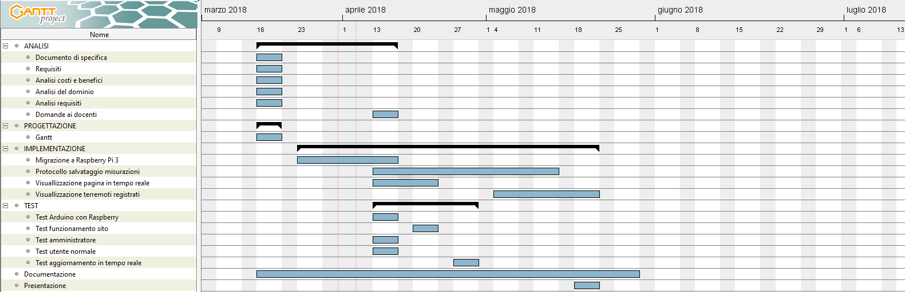

# Survey station
1. [Introduzione](#introduzione)

  - [Informazioni sul progetto](#informazioni-sul-progetto)

  - [Abstract](#abstract)

  - [Scopo](#scopo)

2. [Analisi](#analisi)

  - [Analisi del dominio](#analisi-del-dominio)

    - [Analisi e specifica dei requisiti](#analisi-e-specifica-dei-requisiti)

  - [Analisi dei mezzi](#analisi-dei-mezzi)

  - [Pianificazione](#pianificazione)

3. [Progettazione](#progettazione)

  - [Design dell’architettura del sistema](#design-dell’architettura-del-sistema)

  - [Design dei dati e database](#design-dei-dati-e-database)

  - [Arduino](#arduino)

4. [Implementazione](#implementazione)

5. [Test](#test)

  - [Protocollo di test](#protocollo-di-test)

  - [Risultati test](#risultati-test)

  - [Mancanze/limitazioni conosciute](#mancanze/limitazioni-conosciute)

5. [Consuntivo](#consuntivo)

6. [Conclusioni](#conclusioni)

  - [Sviluppi futuri](#sviluppi-futuri)

  - [Considerazioni personali](#considerazioni-personali)

7. [Sitografia](#sitografia)

8. [Allegati](#allegati)

## Introduzione

### Informazioni sul progetto
  - Allievi: Alessandro Colugnat, Luca Ristagno
  - Docente responsabile: Luca Muggiasca
  - Scuola Arti e Mestieri Trevano (SAMT)
  - Inizio: 16.03.2018
  - Consegna: 18.05.2018
### Abstract
>* The following document has the goal to illustrate the process of developement behind our creation: Survey Station.
This project it's gave to Alessandro Colugnat and Luca Ristagno for make better and faster the Survey Station, this project it's a continuity of a old project who is made by five guys in 2017
### Scopo
  Lo scopo del progetto è quello di velocizzare e migliorare il progetto fatto dai ragazzi dell'anno 2017 cercando di capire ciò che hanno fatto e migliorarlo per avere un sismografo velocè e migliore.
## Analisi

### Analisi del dominio
  Il prodotto dovrà lavorare in un contesto scolastico e 'artigianale', come forma di raccolta e visualizzazione dati più per curiosi che per professionisti. La pagina sarà dunque ovviamente limitata, l'intenzione non è quella di creare un centro geologico o metereologico, ma di avere una piccola stazione di rilevamento e misurazione. L'idea è dunque quella di costruire una 'miniatura' di siti professionali (p.es. sed.ch) in modo, come detto, artigianale e 'casalingo'.

  Per fare questo progetto si dovrà capire ciò che hanno fatto i ragazzi nel 2017 e cercare di capire quali sono le parti che rallentano il codice, si dovrà fare un lavoro di analisi e anche un lavoro di modifica.
### Analisi e specifica dei requisiti

|ID  |REQ-001                                         |
|----|------------------------------------------------|
|**Nome**    |Sismografo |
|**Priorità**|1                     |
|**Versione**|1.0                   |
|**Note**    ||
|            |**Sotto requisiti** |
|**001**      | Costruzione di un sismografo in grado di rilevare le vibrazioni del terreno |
|**002**      | Lo stesso (tramite Arduino o simili) deve essere in grado di inviare i dati al server |

|ID  |REQ-002                                         |
|----|------------------------------------------------|
|**Nome**    |Altri sensori |
|**Priorità**|1                     |
|**Versione**|1.0                   |
|**Note**    ||
|            |**Sotto requisiti** |
|**001**      | Sulla base del sismografo dev'essere possibile aggiungere altri strumenti di misura alla stazione (p.es. barometro o termometro) |
|**002**      | Di nuovo sulla base del sismografo la stazione deve poter inviare i dati al server |

|ID  |REQ-003                                         |
|----|------------------------------------------------|
|**Nome**    |Salvataggio dati|
|**Priorità**|1                     |
|**Versione**|1.0                   |
|**Note**    ||
|            |**Sotto requisiti** |
|**001**      | Non è necessario salvare a lungo termine tutti i dati ricevuti dalla stazione|
|**002**      | Quando i valori entrano in una soglia interessante i dati vengono raccolti e archiviati|

|ID  |REQ-004                                         |
|----|------------------------------------------------|
|**Nome**    | Allarmi e notifiche|
|**Priorità**|1                     |
|**Versione**|1.0                   |
|**Note**    ||
|            |**Sotto requisiti** |
|**001**      | Gli allarmi e le notifiche scattano al superamento di una soglia definita |
|**002**      | Gli utenti registrati, se hanno settato l'opzione, ricevono un e-mail di avviso |
|**003**      | Sulla pagina web viene mostrato l'allarme |
|**004**      | Le e-mail vengono inviate a intervalli regolari in caso di allarme (timespan configurabile), per evitare l'invio continuo all'utente |
|**005**      | Deve essere presente una notifica anche sulla stazione fisica (p.es un LED) |

|ID  |REQ-005                                         |
|----|------------------------------------------------|
|**Nome**    | Admin e utenti|
|**Priorità**|1                     |
|**Versione**|1.0                   |
|**Note**    ||
|            |**Sotto requisiti** |
|**001**     | Deve esserci un form di login e di registrazione |
|**002**     | L'admin ha accesso a una dashboard di gestione |
|**003**     | La registrazione richiede un indirizzo e-mail (univoco nel sistema) e una password |
|**004**     | Gli utenti devono avere la possibilità di cambiare la password |
|**005**     | L'admin può gestire le configurazioni (vedi REQ-006) |
|**006**     | L'admin può gestire gli utenti |

|ID  |REQ-006                                         |
|----|------------------------------------------------|
|**Nome**    | Configurabilità moduli |
|**Priorità**|1                     |
|**Versione**|1.0                   |
|**Note**    ||
|            |**Sotto requisiti** |
|**001**     | Per ogni modulo devono essere configurabili le soglie di valori interessanti |
|**002**     | Per ogni modulo deve essere configurabile il tempo della durata di una misurazione (p.es. un terremoto che non ha picchi per X minuti è da considerarsi concluso) |
|**003**     | Dovranno poi essere configurabili altri parametri |

|ID  |REQ-007                                         |
|----|------------------------------------------------|
|**Nome**    | Raccolta e confronto dati professionali|
|**Priorità**|1                     |
|**Versione**|1.0                   |
|**Note**    ||
|            |**Sotto requisiti** |
|**001**     | È necessario confrontare i dati raccolti con quelli del SED (http://www.seismo.ethz.ch/) |
|**002**     | Questo confronto dev'essere visibile all'utente (sul grafico o tramite tabella) |
|**003**     | I dati vengono raccolti a intervalli regolari (non troppo frequenti a causa del traffico generato) |

|ID  |REQ-008                                         |
|----|------------------------------------------------|
|**Nome**    | Visualizzazione e rappresentazione dati|
|**Priorità**|1                     |
|**Versione**|1.0                   |
|**Note**    ||
|            |**Sotto requisiti** |
|**001**     | I dati raccolti per ogni modulo devono essere mostrati sulla pagina web tramite un grafico con il tempo in ascissa. |
|**002**     | I dati salvati devono essere consultabili |

|ID  |REQ-009                                         |
|----|------------------------------------------------|
|**Nome**    | Modulabilità|
|**Priorità**|1                     |
|**Versione**|1.0                   |
|**Note**    ||
|            |**Sotto requisiti** |
|**001**     | I moduli hanno delle configurazioni che possono essere definite dall'admin (vedi REQ-006) |
|**002**     | Ogni modulo dispone della sua sezione sul sito, con tabella nel DB per il salvataggio dei valori e grafico per la visualizzazione |

### Pianificazione
  In questo capitolo è esposto il Gantt preventivo per l'organizzazione del lavoro
  

  Preventivo costi:

|Risorsa  |Prezzo                                         |
|----|------------------------------------------------|
|**Personale**| 50 CHF/h * 80 h lavoro * 2 = 8000 CHF              |

### Analisi dei mezzi

#### Hardware

|Tipo componente  |Utilizzo nel progetto|
|-----------------|--------------------------------|
|1x Accelerometro|Componente principale, viene utilizzato per ricevere i dati dell'accelerazione nel caso di un sisma|
|1x Led RGB|Utilizzato per creare un segnale fisico sulla scheda|
|1x Veroboard|Utilizzata per saldare i componenti su di essa|
|7x cavi arduino|Utilizzati per collegare i componenti saldati all'arduino|
|1x Arduino Ethernet|Utilizzato per trasmettere i valori dell'accelerometro al database e per controllare il led rgb|
|1x Raspberry pi 3|Utilizzato come webserver e database server|

#### Software

|Nome software|Versione|Utilizzo nel progetto|
|--------|---------|--------------------------------|
|Raspbian| April 2017|Utilizzato come sistema operativo di raspberry|
|Apache| 2.2|Webserver|
|PHP| 5.6|Gestione di php|
|Mysql| 5.5|Database|

## Progettazione

### Design dell'architettura del sistema

Il sistema si basa su 3 grossi passaggi di funzionamento.
In primo luogo c'é l'Arduino collegato a vari sensori, questo si occupa di inviare tramite la rete Ethernet i dati rilevati.
Il secondo punto è rappresentato da un (web)Server che implementa il database. Nel DB i dati vengono raccolti e vengono già parzialmente lavorati.
In questa fase è importante notare la presenza di Raspberry, è infatti quest'ultimo che funge da WebServer, questo è un dettaglio che è stato pensato solo in seguito, quando ci si è resi conto che il servizio che doveva ospitare il lavoro non era adatto alle nostre esigenze.
Nel Raspberry è implementato un semplice sistema LAMP su una scheda da 16 GB.
Infine c'é l'utente che chiama la pagina, questo livello è l'ultimo nel percorso dei dati.
Il codice PHP preleva i dati dal DB, li adatta alla visualizzazione sulla pagina e infine li invia alla stessa.
Questo schema ha il vantaggio di poter essere applicato facilmente a qualunque tipo di rilevamento (prendendo chiaramente coscienza di quello che si sta misurando).

 

Di seguito uno schema che rappresenta l'archietettura della pagina web, essa è costruita in base a pagine php che vengono utilizzate con 'require'. Questo facilita la comprensione, ottimizza i files utilizzati e facilita la modulabilità.

 
 

### Design dei dati e database

La parte di design dei dati ha la funzione di mostrare che tipi di dati sono stati assegnati ai vari attributi delle tabelle presenti nel database. L'immagine che segue mostra il design dei dati del database "surveyStation", usato per questo progetto.

 
Nei campi "Amministratore" e "Email_Notification" ho usato il tipo di dato "tinyint" poiché è molto più conveniente che usare un altro tipo di flag. Si sarebbe potuto usare ad esempio un int e dire che se il campo equivale a 0 il valore è false, mentre se è 1 equivale a true. Sarebbe stata una soluzione che avrebbe portato allo stesso risultato, ma il tipo di dato int è indubbiamente più pesante rispetto al tinyint che assume solamente 2 valori. Per ottimizzare il database, le risorse e la memoria ho deciso di utilizzare questo tipo di dato. Nel nostro progetto la differenza potrebbe non sentirsi poiché le query non occupano tante linee di codice, ma in altri progetti l'ottimizzazione della memoria è cruciale ed è quindi meglio prevenire i disagi legati alle prestazioni.

Lo stesso discorso vale per la scelta effettuata sugli identificatori di ogni tabella. Ho utilizzato il tipo di dato int al posto di un dobule o di un float poiché le chiavi primarie sono sempre caratterizzate da numeri primi e quindi sarebbe stato inutile e dispendioso utilizzare dei tipi di dato che usano la virgola.

Nelle tabelle sismografo e shake, nei campi dove vanno inseriti i valori, ho preferito optare per un tipo di dato int piuttosto che altri poiché per la nostra analisi vanno benissimo i numeri senza virgola. Ciò comporta, come spiegato in precedenza, un miglioramente delle prestazioni e un risparmio di memoria.

### Schema E-R, schema logico e descrizione.

Lo schema E-R è fondamentale per la creazione di un database e quindi sono dovuto partire da qui per poi passare a scrivere il codice sql. Qui di seguito si può osservare come ho pensato di strutturare il database con le rispettive tabelle.

 
Per creare questo schema ho pensato a come questo progetto verrà utilizzato. Ovviamente diverse persone vi accederanno con il proprio account e ciò mi ha fatto subito pensare ad una tabella che gestisca gli utenti che usufruiscono del servizio da noi messo in piedi.
 
L'arduino, al quale è attaccato un sensore, si occupa di percepire le vibrazioni terrestre che avvengono e quindi i dati da esso registrati devono essere registrati da qualche parte. Da qui è nata la tabella sismografo.
 
Ovviamente, e auspicabilmente, la maggior parte dei dati registrati dall'arduino ed inseriti nella tabella sismografo sono insignificanti poiché non permettono di osservare nulla. La parte "interessante", dal punto di vista d'analisi, si verifica quando vi è una scossa di ciò che secondo l'arduino è etichettabile come una scossa di terremoto. Ho creato la tabella Shake per poterci inserire i dati interessanti e in modo da facilitare il lavoro anche a coloro che si sono occupati della rappresentazione grafica dei dati in questione.
 
Salta subito all'occhio che le tabelle presenti nello schema non sono in nessun modo relazionate tra di loro. Non si tratta di un errore o di disattenzione, ma semplicemente per raggiungere il nostro obiettivo non c'era il bisogno di creare delle relazioni.
 
Nella tabelle "utente" l'identificatore primario è il campo "email". Abbiamo optato per questa soluzione poiché due o più utenti non possono avere lo stesso indirizzo email e ciò fa risparmiare anche memoria, oltre che a rendere più ordinata e pulita la tabella e il codice che la riguarda.  

### Arduino

#### Struttura

La struttura è stata progettata per contenere Raspberry, Arduino, Veroboard (con su saldati accelerometro e led) e Breadboard per eventuali lavori o aggiunte future.

L'accelerometro è stato collegato ad un Arduino con il collegamento per il cavo Ethernet tramite i pins 'scl' e 'sda', poi per l'alimentazione del componente viene usato un voltaggio di 3,3V e infine viene collegato al gnd per andare a massa.
Il led RGB viene collegato al gnd, al pin 6 per il colore rosso e 5 per il colore verde, il pin blu del componente non viene utilizzato poichè al momento non serve il colore blu in quanto questo led viene utilizzato come segnale in caso di rilevamento di un sisma, in questo caso il led diventerà di colore rosso, nel secondo caso quando non viene rilevato niente, il led rimarrà di colore verde.

#### Codice
Lo scopo di Arduino e del suo codice è quello di prelevare i dati rilevati dall'accelerometro, contattare il server e la pagina PHP di riferimento, creare l'URL con i relativi valori e spedirli. Oltre a ciò si deve occupare di controllare i dati e, nel quale ci fosse un'anomalia o un terremoto, illuminare l'apposito led.
 
Il codice di Arduino importa tre librerie esterne:
- <b>Ethernet:</b> include tutte le funzioni per eseguire le connessioni e le richieste.
- <b>SPI:</b> serve da supporto alla libreria Ethernet.
- <b>SFE_MMA8452Q:</b> questa libreria implementa la completa gestione dell'accelerometro.

 
<b>Attributi:</b>

- <b>redPin:</b> È il pin con cui alimentare il colore rosso del led.  
- <b>greePin:</b> È il pin con cui alimentare il colore verde del led.  
- <b>mac:</b> È il MAC Address della scheda Arduino.  
- <b>serverIp:</b> È l'indirizzo IP del server.  
- <b>arduinoIp:</b> È l'indirizzo IP di Arduino.  
- <b>client:</b> È il client ethernet. Serve a contattare il server e la pagina PHP.  
- <b>strURL:</b> È la stringa URL che si spedirà tramite client. All'interno di essa si formatterà un URL con la pagina da chiamare e i valori di X, Y e Z.  
- <b>accel:</b> È l'istanza dell'accelerometro.

 
<b>Funzioni:</b>

- <b>setup(): </b> Funzione di settaggi e istanze. 
- <b>loop(): </b> Innanzitutto richiama la funzione updateValues. Dopodichè controlla se il client è disponibile. Se non lo è stampa un messaggio d'errore. 
- <b>updateValues(): </b> Per prima cosa si connette al server, successivamente controlla se l'accelerometro è disponibile. Nel caso di un riscontro positivo si verificano le coordinate prelevate dal sensore. Infine si crea la stringa con i valori formattata con le regole di un URL. 

#### Pagina PHP
Il lavoro che deve fare la pagina PHP è quello di recuperare X, Y e Z dall'URL trasmesso da Arduino. Dopodichè deve connettersi al database "surveystation" e alla tabella "sismografo". La pagina si deve occupare di creare la query e di eseguirla correttamente.

## implementazione

#### Codice di Arduino
Nel codice di Arduino sono statie aggiunte modifica per quando si prendono i dati, inizialmente quando si posizionava il prodotto doveva essere messo orizzontale al piano per avere una situazione di calma da un terremoto è quando si inclinava risultava che c'era uno scossone, il problema si situava nell'if perchè prima veniva visto lo spostamento senza un confronto dei dati trovati prima. Il codice è stato ristrutturato in modo per far usare l'arduino anche in un piano inclinato:

(cxi < (accel.cx + margine) && cxi > (accel.cx - margine)) || (cyi < (accel.cy + margine) && cyi > (accel.cy - margine)) || (czi < (accel.cz + margine) && czi > (accel.cz - margine))

Questo serve per vedere quando il sismografo sia effetivamente in un caso di terremoto.
cxi, cyi, czi sono i dati precedentemente calcolati dal sismografo che vengono comparati con i dati trovati nell'istante con un margine per fare in modo che i dati abbiamo un differenziale.

Per esempio:

margine = 0.03;

cxi = 0.06;

accel.cx = 0.08;

In questo caso si entrerà nell'if perchè cxi è diverso da accel.cx più il margine di errore.
Nel codice di Arduino è stato tolto anche il delay perchè rallentava il programma.
Qunado il delay è stato tolto il grafico era più fluido perchè non aveva problemi nell'inviare dati, ci sono ancora dei problemi perchè quando arrivano dei dati alti il grafico si blocca per un paio di secondi ma puoi continua a far vedere gli altri dati.

#### Pagina PHP
Nel codice della pagina PHP sono state aggiunte delle modifiche per la parte delle mail anche se con insuccesso, avevamo installato il protocollo ssmpt per poter inviare delle mail in caso di un terremoto e abbiamo creato un if che controlla i valori x, y e z del sismografo e in caso di terremoto mandava una mail a chi aveva confermato l'opzione della notifica tramite mail
il metodo in php che abbiamo usato è questo: mail(to,subject,message,header)

### Database
Nel codice del database era stata applicata una modifica che però aveva danneggiato il database quindi non è stata applicata, il pezzo di codice che avevamo aggiunto era un trigger che serviva a limitare il carico di dati del database nella tabella sismografo, questo era il codice di test che era stato testato sulla macchina di luca in locale:

### Sito Web
Nel sito web sono state modifica le descrizione di come si usa il sito, inizialmente nel sito non c'era una descrizione di cosa facesse il sito, quindi per l'utente che lo utilizzava non sapeva quall'era l'utilità del sito, noi abbiamo aggiunto la descrizione di cosa fa il sito. È stata modifica la velocità di mostrazione dei dati nel grafico, ora il grafico fa vedere i dati in maniera più scorrevole, faccendo in modo che l'utente noti i dati in tempo reale.

## Test
Per i test abbiamo ripreso i dati dalla documentazione precedentemente fatta dai ragazzi che hanno iniziato questo progetto.

### Protocollo di test

|Test Case      | TC-001                               |
|---------------|--------------------------------------|
|**Nome**       | Ricevimento dati sul server |
|**Riferimento**| REQ-001                               |
|**Descrizione**| Verificare che i dati arrivino correttamente. |
|**Prerequisiti**| - |
|**Procedura**     | Collegare l'Arduino con il programma a un PC con il software Arduino IDE. Aprire il serial monitor ed analizzare i dati che vengono ricevuti ed inviati. A questo punto collegarsi al database e verificare che arrivino i medesimi dati. |
|**Risultati attesi** | I valori arrivano correttamente con un ritardo non pesante (può dipendere dal carico della rete). |

 

|Test Case      | TC-002                               |
|---------------|--------------------------------------|
|**Nome**       | Altri sensori |
|**Riferimento**| REQ-002                               |
|**Descrizione**| Verificare la possibilità di aggiungere altri sensori. |
|**Prerequisiti**| - |
|**Procedura**     | Sviluppare le pagine di visualizzazione copiando e modificando leggermente quelle del sismografo. Creare una tabella adatta ai dati misurati. Collegare all'Arduino il nuovo sensore, implementare il codice in modo che la scheda riceva i dati, come per il TC-002 verificare che i dati vengano ricevuti ed inviati. Collegarsi al db e verificare la presenza dei dati. Controllare poi le relative pagine per la visualizzazione. |
|**Risultati attesi** | Il rilevamento e la visualizzazione sono funzionanti. |

 

|Test Case      | TC-003                               |
|---------------|--------------------------------------|
|**Nome**       | Allarmi e notifiche |
|**Riferimento**| REQ-004                               |
|**Descrizione**| Verificare che una scossa venga notificata come previsto. |
|**Prerequisiti**| TC-001 passato |
|**Procedura**     | Creare un utente con email conosciuta e accessibile. Agitare l'accelerometro per simulare un terremoto, verificare che il LED passi da verde a rosso. Verificare mentre lo si fa che sulla pagina compaia un allarme, fatto questo accedere all'email e verificare di aver ricevuto l'avviso. A questo punto disabilitare l'opzione in cui si sceglie di ricevere le email, simulare un'altra scossa e verificare di non ricevere ulteriori messaggi di posta. |
|**Risultati attesi** | Gli avvisi sono presenti sulla pagina, per email arrivano solo se si è selezionata l'opzione. |

 

|Test Case      | TC-004                               |
|---------------|--------------------------------------|
|**Nome**       | Configurabilità moduli |
|**Riferimento**| REQ-006, REQ-009                               |
|**Descrizione**| Verificare di poter configurare i moduli |
|**Prerequisiti**| TC-005 passato |
|**Procedura**     | Accedere come utente comune e inserire a mano l'url della dashboard dell'admin (/surveystation/admin). Fatto questo uscire e rientrare con un utente amministratore. Andare sulla propria icona di profilo, cliccare gestione avanzata, modificare un parametro e salvare. Collegarsi al database e visualizzare i dati della tabella configurazione. |
|**Risultati attesi** | Come utente comune non si riesce a visualizzare la pagina (esce un avviso di permessi). Quando vi si accede come admin si possono modificare i parametri, una volta salvati le modifiche devono essere avvenute sul db. |

 

|Test Case      | TC-005                               |
|---------------|--------------------------------------|
|**Nome**       | Raccolta dati professionali |
|**Riferimento**| REQ-007                               |
|**Descrizione**| Verificare che vengano raccolti e visualizzati dati da piattaforme professionali. |
|**Prerequisiti**| - |
|**Procedura**     | Visitare la pagina con il grafico. |
|**Risultati attesi** | È presente la tabella con i dati raccolti dal SED. |

 

|Test Case      | TC-006                               |
|---------------|--------------------------------------|
|**Nome**       | Visualizzazione dati |
|**Riferimento**| REQ-008                               |
|**Descrizione**| Verificare visualizzazione dei dati. |
|**Prerequisiti**| - |
|**Procedura**     | Visitare la pagina con il grafico, verificare che il grafico prosegua, verificare che le date sull'asse X siano corrette. A questo punto andare sotto il grafico e aprire la finestra di un singolo terremoto (cliccare su Apri nella tabella). Verificare che esca un grafico rappresentante quell'evento. |
|**Risultati attesi** | Il grafico si aggiorna in tempo reale. Aprendo i modal si ottiene un grafico fermo del singolo evento. |

 

|Test Case      | TC-007                               |
|---------------|--------------------------------------|
|**Nome**       | Moduli |
|**Riferimento**| REQ-007                               |
|**Descrizione**| Verificare la presenza di moduli e parametri annessi. |
|**Prerequisiti**| - |
|**Procedura**     | Tramite la pagina di amministrazione settare dei parametri facilmente verificabili (ad esempio la soglia di salvataggio), andare poi a verificare il cambio (in questo caso sul database). |
|**Risultati attesi** | I parametri modificati vanno a modificare il comportamento specifico del sistema. |
 

|Test Case      | TC-008                               |
|---------------|--------------------------------------|
|**Nome**       |Dati da sismografo a shake. |
|**Riferimento**|REQ-003                               |
|**Descrizione**|Quando si chiama la procedura i dati non più vecchi di un determinato valore vengono inseriti dalla tabelle sismografo nella shake.  |
|**Prerequisiti**|Bisogna aver creato la tabella sismografo e shake.|
|**Procedura**     | Si inserisce qualche dato nella tabella sismografo. Si aspettano 2 minuti e si chiama la procedura passandole un Id e come quantitativo dei minuti si inserisce 5.|
|**Risultati attesi** |Nella tabella shake ci devono essere i dati che ho inserito 2 minuti fa. |

 

|Test Case      | TC-009                               |
|---------------|--------------------------------------|
|**Nome**       | Individuamento picco di dati.|
|**Riferimento**|REQ-003                               |
|**Descrizione**| Quando viene rilevato un dato interessante i dati cominciano ad essere inseriti nella tabella shake. |
|**Prerequisiti**|Bisogna aver creato la tabella sismografo, shake, configurazione e la procedura storePreviousValues.|
|**Procedura**     |In sismografo si inseriscono dei valori non interessanti. Successivamente si inserisce un valore interessante e dopo altri dati di cui valore non è importante. |
|**Risultati attesi** |Nella tabella shake ci devono essere i dati a partire da quando c'è stato il picco. |

 

|Test Case      | TC-010                               |
|---------------|--------------------------------------|
|**Nome**       | Cancellare dati vecchi.|
|**Riferimento**|REQ-003                               |
|**Descrizione**| La procedura, una volta chiamata, deve cancellare i dati più vecchi di un determinato lasso temporale (specificato nel parametro) dalla tabella sismografo. |
|**Prerequisiti**|Bisogna aver creato la tabella sismografo e configurazione.|
|**Procedura**     | Si inseriscono dei dati nella tabella sismografo. Se il parametro che specifica dopo quanto tempo eliminare i dati equivale ad 2, si aspettano 2 minuti. Si chiama la procedura deleteOldData.|
|**Risultati attesi** |Nella tabella sismografo non ci devono più essere dati. |

 

|Test Case      | TC-011                               |
|---------------|--------------------------------------|
|**Nome**       | Immagazzinare dati ogni minuto.|
|**Riferimento**|REQ-003                               |
|**Descrizione**| Tramite un evento, la procedura storePreviousData viene chiamata autonomamente ogni minuto. |
|**Prerequisiti**|Bisogna aver creato la tabella sismografo, shake e la procedura storePreviousData.|
|**Procedura**     |Si fa partire l'evento (quando si crea il database). Si inseriscono dei dati in sismografo. |
|**Risultati attesi** |Dopo un minuto i dati devono essere nella tabella shake. |

 

|Test Case      | TC-012                               |
|---------------|--------------------------------------|
|**Nome**       | Cancellare dati ogni ora.|
|**Riferimento**|REQ-003                               |
|**Descrizione**| Tramite un evento, la procedure deleteOldData viene chiamata autonomamente ogni minuto. |
|**Prerequisiti**|Bisogna aver creato la tabella sismografo, shake e la procedure deleteOldData.|
|**Procedura**     |Si fa partire l'evento (quando si crea il database). Si inseriscono dei dati in sismografo.|
|**Risultati attesi** |Dopo un minuto nella tabella sismografo non ci deve essere più nessun dato. |

### Risultati test

|Test Case      | Risultato                             |
|---------------|---------------------------------------|
| TC-001        | Passato                   |
| TC-002        | Non testabile, nessuna aggiunta di altri sensori                   |
| TC-003        | Passato, ma nessun invio di email                   |
| TC-004        | Passato                   |
| TC-005        | Non passato                   |
| TC-006        | Passato                   |
| TC-007        | Passato                   |
| TC-008        | Passato                   |
| TC-009        | Passato                   |
| TC-009        | Passato                   |
| TC-010        | Passato                   |
| TC-011        | Passato                   |
| TC-012        | Passato                   |

### Mancanze/limitazioni conosciute
Abbiamo avuto delle limitazioni per quando abbiamo provato a fare l'invio delle mail perchè non sapevamo come creare un server ssmtp funzionante, ci sono stati dei problemi per quando si doveva leggere il codice, non era sufficentemente commentato e questo ci ha portato dei problemi che in futuro non siamo riusciti a risolvere.

## Consuntivo
Il Gantt ha subito leggeri cambiamenti verso la fine per dei problemi legati al database.

## Conclusioni

### Sviluppi futuri
Per questo progetto ci sarebbe da correggere il sito siccome possiede alcuni bug (non del tutto responsive) e poi ci sarebbe da far funzionare la parte delle mail
### Considerazioni personali
- Alessandro
- Ho scelto questo progetto perchè in classe durante le lezione ne sentivo parlare e questo mi ha fatto venire voglia di capire il funzionamento del sismografo e portare dei miglioramenti per farlo funzionare meglio. Il progetto mi ha insegnato come utilizzare un raspberry e come communicare tra arduino a server, sono soddisfatto per i cambiamenti che ho portato al progetto anche se non sono funzionali al cento per cento.

- Luca
- Ho scelto questo progetto perchè in confronto alle altre scelte mi sembrava il più interessante, questo progetto mi ha insegnato come utilizzare il raspberry Pi3 e come far comunicare arduino e server nonostante ho guardato poco il codice dell'arduino. Nonostante non sia riuscito a far funzionare la parte della mail sono soddisfatto del risultato del progetto.
## Bibliografia

### Sitografia
- https://www.w3schools.com/php/php_ref_mail.asp per il codice php delle mail
- https://www.w3schools.com/php/func_mysqli_query.asp per le query sql tramite php

## Allegati
- Diari
- Codice arduino
